# Домашнее задание к занятию 1 «Введение в Ansible», Лебедев А.И., fops-10

## Подготовка к выполнению

1. Установите Ansible версии 2.10 или выше.
2. Создайте свой публичный репозиторий на GitHub с произвольным именем.
3. Скачайте [Playbook](./playbook/) из репозитория с домашним заданием и перенесите его в свой репозиторий.

## Основная часть

1. Попробуйте запустить playbook на окружении из `test.yml`, зафиксируйте значение, которое имеет факт `some_fact` для указанного хоста при выполнении playbook.
2. Найдите файл с переменными (group_vars), в котором задаётся найденное в первом пункте значение, и поменяйте его на `all default fact`.
3. Воспользуйтесь подготовленным (используется `docker`) или создайте собственное окружение для проведения дальнейших испытаний.
4. Проведите запуск playbook на окружении из `prod.yml`. Зафиксируйте полученные значения `some_fact` для каждого из `managed host`.
5. Добавьте факты в `group_vars` каждой из групп хостов так, чтобы для `some_fact` получились значения: для `deb` — `deb default fact`, для `el` — `el default fact`.
6.  Повторите запуск playbook на окружении `prod.yml`. Убедитесь, что выдаются корректные значения для всех хостов.
7. При помощи `ansible-vault` зашифруйте факты в `group_vars/deb` и `group_vars/el` с паролем `netology`.
8. Запустите playbook на окружении `prod.yml`. При запуске `ansible` должен запросить у вас пароль. Убедитесь в работоспособности.
9. Посмотрите при помощи `ansible-doc` список плагинов для подключения. Выберите подходящий для работы на `control node`.
10. В `prod.yml` добавьте новую группу хостов с именем  `local`, в ней разместите localhost с необходимым типом подключения.
11. Запустите playbook на окружении `prod.yml`. При запуске `ansible` должен запросить у вас пароль. Убедитесь, что факты `some_fact` для каждого из хостов определены из верных `group_vars`.
12. Заполните `README.md` ответами на вопросы. Сделайте `git push` в ветку `master`. В ответе отправьте ссылку на ваш открытый репозиторий с изменённым `playbook` и заполненным `README.md`.
13. Предоставьте скриншоты результатов запуска команд.

## Необязательная часть

1. При помощи `ansible-vault` расшифруйте все зашифрованные файлы с переменными.
2. Зашифруйте отдельное значение `PaSSw0rd` для переменной `some_fact` паролем `netology`. Добавьте полученное значение в `group_vars/all/exmp.yml`.
3. Запустите `playbook`, убедитесь, что для нужных хостов применился новый `fact`.
4. Добавьте новую группу хостов `fedora`, самостоятельно придумайте для неё переменную. В качестве образа можно использовать [этот вариант](https://hub.docker.com/r/pycontribs/fedora).
5. Напишите скрипт на bash: автоматизируйте поднятие необходимых контейнеров, запуск ansible-playbook и остановку контейнеров.
6. Все изменения должны быть зафиксированы и отправлены в ваш личный репозиторий.

---

### Как оформить решение задания

Выполненное домашнее задание пришлите в виде ссылки на .md-файл в вашем репозитории.

---

## Выполнение:  
  
- **Ниже я привел все скриншоты, которые сделал в процессе выполнения, также, вот с какими трудностями я столкнулся:**  
  
- Клонирование единичной папки из репозитория. Это не так просто, как кажется. Нашел в интернете.  
  
- Снова забыл, что, что б контейнер был запущен, в нем должен происходить какой-то процесс. Для этого была использована следующая конструкция:  
  
```  
docker run -d --name ubuntu ubuntu:latest sleep infinity
docker run -d --name centos7 centos:7 sleep infinity  
```  
  
- В один из контейнеров с системой изначально не был установлен Python3 и ансибл не хотел иметь с ним дело. Доустановил руками.  
  
- В доп. задании с созданием новой переменной в ./group_vars/all/, при ее создании, все-равно, брались переменные из deb, el и inside, хотя, я прописал в hosts:all. Чесал репу, так и не понял в чем прикол. Закомментил значения в deb, el, inside и так и оставил. Поясните, почему не схватил из all? *см. файлы*  
  
- Я не стал ставить третью систему в доккер, но скрипт выложил.  
  
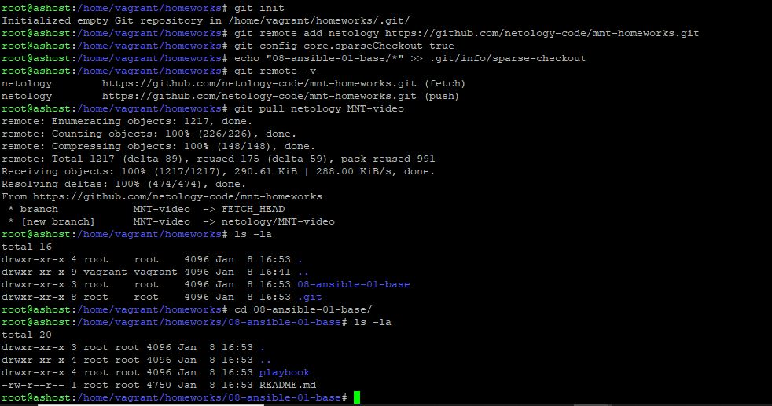  
  
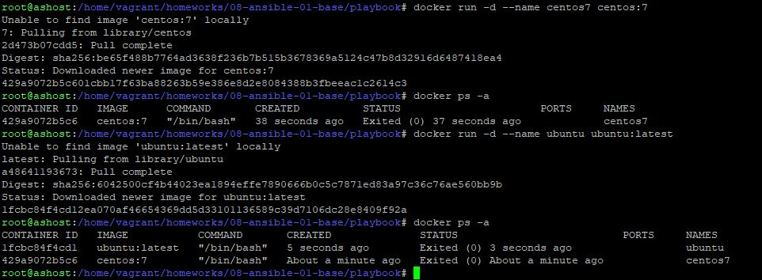  
  
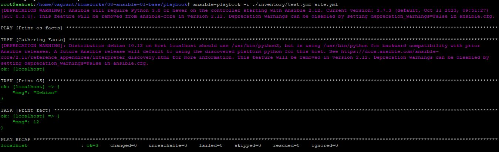  
  
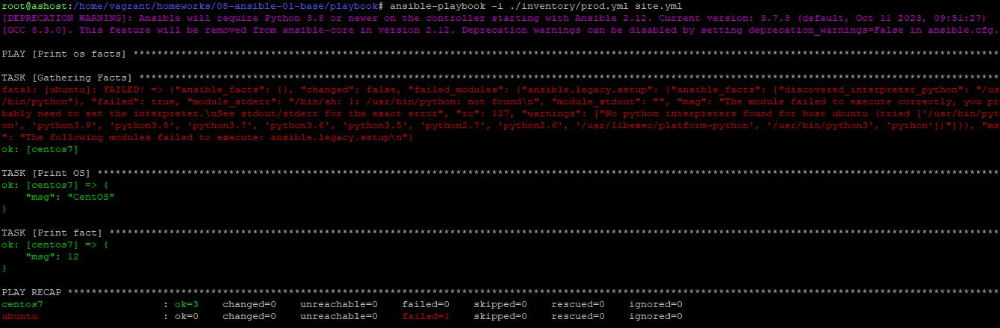  
  
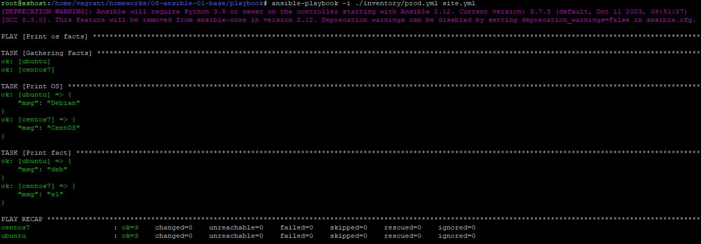  
  
  
  
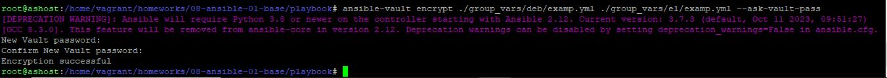  
  
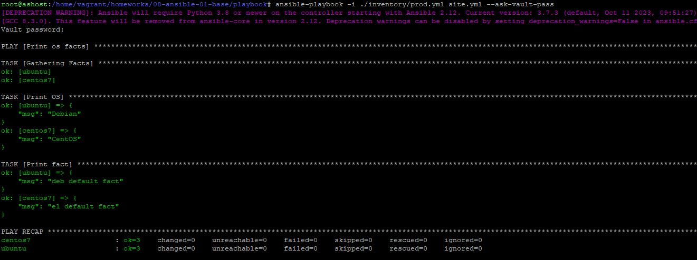  
 
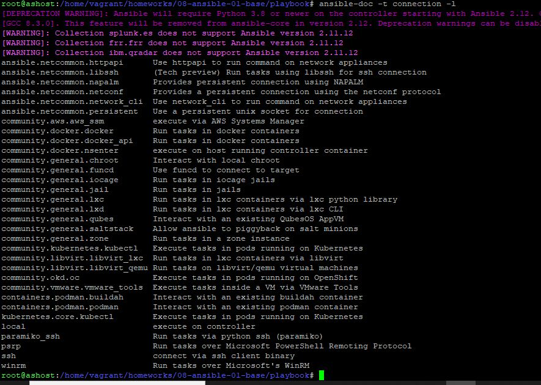  
  
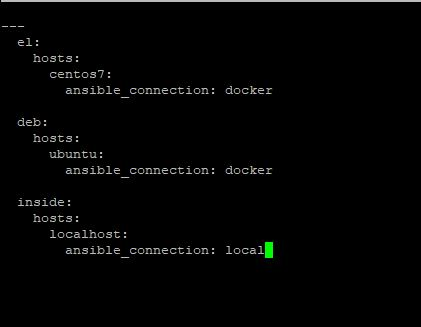  
  
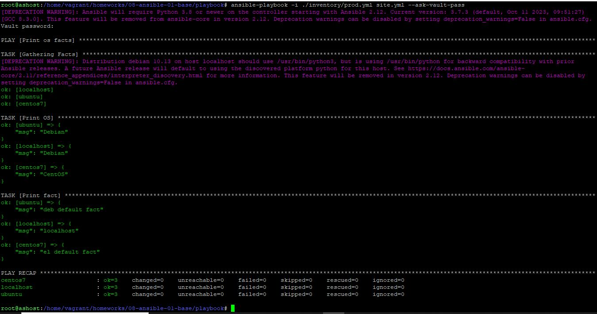  
  
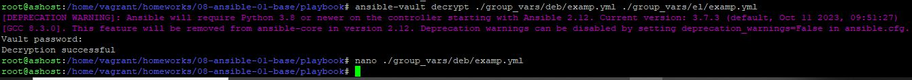  
  
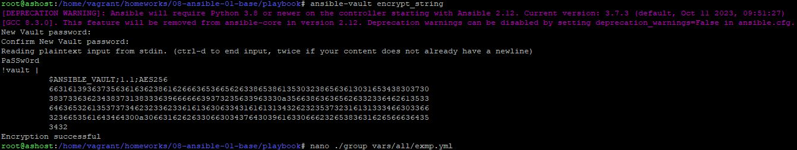  
  
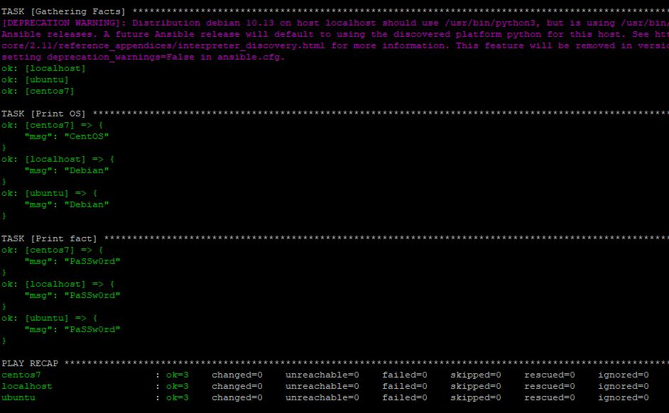  
  
---


 
