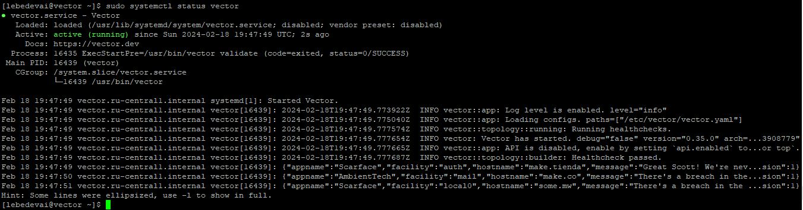

# Домашнее задание к занятию 3 «Использование Ansible», Лебедев А.И., fops-10

## Основная часть

1. Допишите playbook: нужно сделать ещё один play, который устанавливает и настраивает LightHouse.
2. При создании tasks рекомендую использовать модули: `get_url`, `template`, `yum`, `apt`.
3. Tasks должны: скачать статику LightHouse, установить Nginx или любой другой веб-сервер, настроить его конфиг для открытия LightHouse, запустить веб-сервер.
4. Подготовьте свой inventory-файл `prod.yml`.
5. Запустите `ansible-lint site.yml` и исправьте ошибки, если они есть.
6. Попробуйте запустить playbook на этом окружении с флагом `--check`.
7. Запустите playbook на `prod.yml` окружении с флагом `--diff`. Убедитесь, что изменения на системе произведены.
8. Повторно запустите playbook с флагом `--diff` и убедитесь, что playbook идемпотентен.
9. Подготовьте README.md-файл по своему playbook. В нём должно быть описано: что делает playbook, какие у него есть параметры и теги.
10. Готовый playbook выложите в свой репозиторий, поставьте тег `08-ansible-03-yandex` на фиксирующий коммит, в ответ предоставьте ссылку на него.

---

## Решение:  

- Уважаемые друзья, ввиду большой загруженности, а, также, тем, что я заболел коронавирусом в третий раз, я очень долго делал это задание, но, признаться, так и не доделал его до конца. Поэтому, хотелось бы спросить, что я сделал не так.

- Собственно, по аналогии, все выглядит неплохо, кроме веб-морды (она же - lighthouse). Она у меня висит в ошибке 403 и открываться не хочет.

- Я прилагаю весь плэйбук с переменными и прочим и я очень вас прошу УКАЗАТЬ мне на мою ошибку.

- Я полагаю, что веб-сервер смотрит куда-то не туда и выдаёт мне 403ю, но, я не понимаю, где я совершил оплошность.

- И вектор и кликхаус, вроде бы, живы.

- Я несного пероеделал плэйбук, т.к. ансибл валился в ошибку, видя уже установленный кликхаус или вектор. Это тоже очень странно. Думаю, это связано с тем, что они устанавливаются не стандартно.

- В общем, я прошу вас посомтреть весь мой код и дать мне разъяснения, где моя ошибка. Буду очень признателен и попытаюсь ее исправить.

### Доработка:  

- Друзья, это было сложно и странно. Давайте начнем с начала. Вот мои сервера, поднятые на YC:

  

- Проверим, что на каждом из них (кроме lighthouse) работает его служба после выполнения плэйбука:

   

      

- Служба Vector чере какое-то время уходит в inactive, но, думаю, это из-за того, что никаких активных процессов с ней не происходит.

- Ок. Самое интересное было с lighthouse. Он стабильно отказывал мне в доступе. Я уже и выдавал права 777 на папку и менял пользователя, но nginx туда стабильно не ходил. "Победить" я это смог только SELinux правилом(!!!) -

```
chcon -R -t httpd_sys_content_t /home/my_home_catalog/lighthouse
```

- И, наконец-то:

  

- Я не знаю, почему так. Система везде - Centos7. В чем проблема, я так и не понял...


