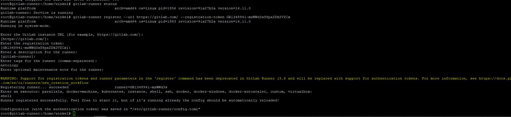
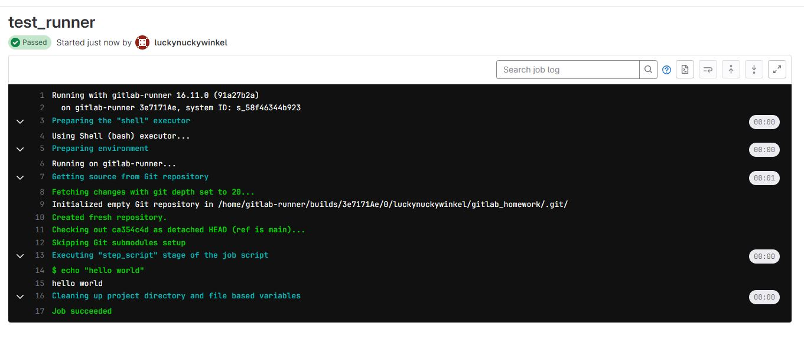
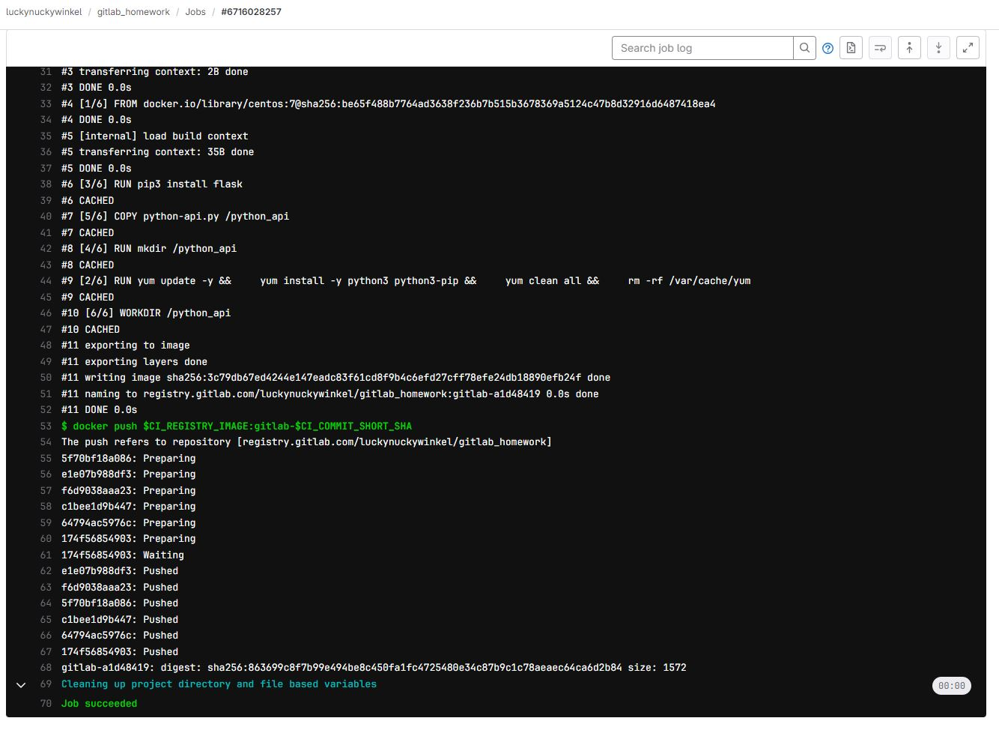
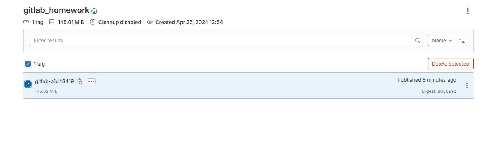

# Домашнее задание к занятию 12 «GitLab», Лебедев А.И., FOPS-10

## Подготовка к выполнению


1. Или подготовьте к работе Managed GitLab от yandex cloud [по инструкции](https://cloud.yandex.ru/docs/managed-gitlab/operations/instance/instance-create) .
Или создайте виртуальную машину из публичного образа [по инструкции](https://cloud.yandex.ru/marketplace/products/yc/gitlab ) .
2. Создайте виртуальную машину и установите на нее gitlab runner, подключите к вашему серверу gitlab  [по инструкции](https://docs.gitlab.com/runner/install/linux-repository.html) .

3. (* Необязательное задание повышенной сложности. )  Если вы уже знакомы с k8s попробуйте выполнить задание, запустив gitlab server и gitlab runner в k8s  [по инструкции](https://cloud.yandex.ru/docs/tutorials/infrastructure-management/gitlab-containers). 

4. Создайте свой новый проект.
5. Создайте новый репозиторий в GitLab, наполните его [файлами](./repository).
6. Проект должен быть публичным, остальные настройки по желанию.

## Выполнение подготовки:  

- Заведем машину на YC. Ресурсов дадим ей не много, т.к. сборка не сложная, установим туда гитлаб-раннер и зарегистрируем:

  

- Напишем тестовый пайплайн, чтобы проверить работу раннера и прогоним его:

```
stages:
  - test

test_runner:
  stage: test
  rules:
    - if: $CI_COMMIT_BRANCH == "main"
  script: 
    - echo "hello world"
```


  

- Все отлично. Можно переходить к основной части.


## Основная часть

### DevOps

В репозитории содержится код проекта на Python. Проект — RESTful API сервис. Ваша задача — автоматизировать сборку образа с выполнением python-скрипта:

1. Образ собирается на основе [centos:7](https://hub.docker.com/_/centos?tab=tags&page=1&ordering=last_updated).
2. Python версии не ниже 3.7.
3. Установлены зависимости: `flask` `flask-jsonpify` `flask-restful`.
4. Создана директория `/python_api`.
5. Скрипт из репозитория размещён в /python_api.
6. Точка вызова: запуск скрипта.
7. При комите в любую ветку должен собираться docker image с форматом имени hello:gitlab-$CI_COMMIT_SHORT_SHA . Образ должен быть выложен в Gitlab registry или yandex registry.

### DevOps часть:  

- Для начала я написал доккерфайл:

```
FROM centos:7


RUN yum update -y && \

    yum install -y python3 python3-pip && \
    yum clean all && \
    rm -rf /var/cache/yum


RUN pip3 install flask


RUN mkdir /python_api
COPY python-api.py /python_api


WORKDIR /python_api


CMD ["python3", "/python_api/python-api.py"]
```

- На данном этапе, пайплайн выглядит вот так:

```
image: docker:latest

variables:
  DOCKER_TLS_CERTDIR: ""
  DOCKER_DRIVER: overlay2

stages:
  - build

before_script:
  - unset DOCKER_HOST
  - docker login -u $CI_REGISTRY_USER -p $CI_REGISTRY_PASSWORD $CI_REGISTRY

build_and_publish_image:
  stage: build
  script:
    - docker build --build-arg PYTHON_VERSION=3.7 -t $CI_REGISTRY_IMAGE:gitlab-$CI_COMMIT_SHORT_SHA .
    - docker push $CI_REGISTRY_IMAGE:gitlab-$CI_COMMIT_SHORT_SHA
  rules:
    - if: $CI_COMMIT_BRANCH == "main"
  tags:
    - netology
```

- Пришлось подкрутить кое-какие настройки доккера на раннере, но все вышло. Пайп проходит, продукт падает в реджистри гитлаба:

  




### Product Owner

Вашему проекту нужна бизнесовая доработка: нужно поменять JSON ответа на вызов метода GET `/rest/api/get_info`, необходимо создать Issue в котором указать:

1. Какой метод необходимо исправить.
2. Текст с `{ "message": "Already started" }` на `{ "message": "Running"}`.
3. Issue поставить label: feature.

### Developer

Пришёл новый Issue на доработку, вам нужно:

1. Создать отдельную ветку, связанную с этим Issue.
2. Внести изменения по тексту из задания.
3. Подготовить Merge Request, влить необходимые изменения в `master`, проверить, что сборка прошла успешно.


### Tester

Разработчики выполнили новый Issue, необходимо проверить валидность изменений:

1. Поднять докер-контейнер с образом `python-api:latest` и проверить возврат метода на корректность.
2. Закрыть Issue с комментарием об успешности прохождения, указав желаемый результат и фактически достигнутый.

## Итог

В качестве ответа пришлите подробные скриншоты по каждому пункту задания:

- файл gitlab-ci.yml;
- Dockerfile; 
- лог успешного выполнения пайплайна;
- решённый Issue.

### Важно 
После выполнения задания выключите и удалите все задействованные ресурсы в Yandex Cloud.

